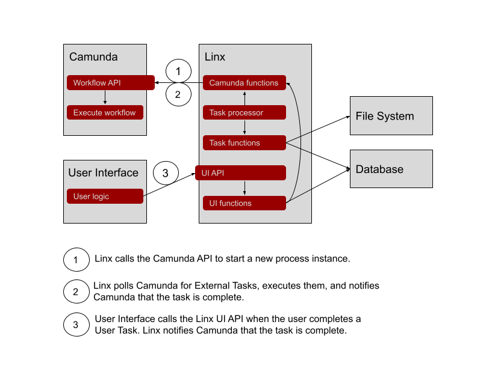

# file-import-process

## Description

Automatically importing data into systems from files is quite a common process but getting it to run smoothly is not always trivial especially if we have inconsistent data, complex validation rules, enrichment data that goes out of date, systems that go down etc.

This project is a generic file import process implemented with workflow engine Camunda and low-code platform Linx. Camunda runs the workflow and Linx does the file parsing, data validation and other technical bits. Linx communicates with Camunda through Camunda's REST API. 

Business process:

Architecture:

A workflow instance is created for every file received. Camunda keeps the state of the workflow instance while Linx executes all the automated tasks. The file is the unit of work so all tasks execute on data related to the file.

For more on how the Linx solution works see the [wiki](https://github.com/linx-software/file-import-process/wiki)

## Installation

1. Install Camunda by following [these](https://docs.camunda.org/manual/latest/installation/) instructions. The easiest way is to use Docker. If you have Docker just run 

        docker run -d --name camunda -p 8080:8080 camunda/camunda-bpm-platform:latest

1. Install Camunda Modeler. Download it [here.](https://camunda.com/download/modeler/)
1. Install Linx Designer. Download it [here.](https://linx.software)

## Tests

The project includes a generic import workflow, test files, database and logic implemented in Linx to show how all the pieces work together. The process imports csv files containing customer records, enriches and validates the data, allows a user to fix anything that fails validation, and updates a master customer database table.

The business rules applied are:

- All fields must contain data
- A Region field is added to the target data by doing a lookup using the Country field
- Email must be in a valid email format
- Region must be valid
- The target may only be updated if all of the records in the file are valid.

To set it up:

1. Open file-import.bpmn with Camunda Modeler and deploy it to the Camunda Engine. The deployment name is `file-import` and, if you followed the defaults, the endpoint should be `http://localhost:8080/engine-rest`.
1. Create the database by running /database/create-database.sql on a MySQL database server. You could use another database but would have to change the database connections in the Linx solution.
1. Create a folder to act as the root to your files. Create subfolders called `in`, `processing`, `completed` and `test`. Copy the files under *test* in this repo to the `test` folder. 
1. Open file-import.lsoz with Linx, open Settings and
    1. Change the value of FilesRootFolder to the root folder you created in the previous step. You are free to change these folders but remember to change the Settings that contain them as well.
    1. Change the value of DatabaseConnection to your database connection string. The solution uses an ODBC driver. A typical MySQL connection string looks like this: `Uid=root;Driver={MySQL ODBC 8.0 ANSI Driver};Server=localhost;Database=FileImport;Pwd=*;` You may use other drivers but will have to change the ConnectionType property on the ExecuteSQL functions used in the Linx solution.

The tests are located in Linx under the *Test* folder. Their names all start with *Test*.

Run each test on its own or run all the tests by selecting *RunAllTests* and clicking *Debug* and *Start*. It will take a while but wait until you see `Debug finished` in the *Debug Output* window. If something is not working you'll see it...

## Customize

Customizing the project to suit other data is relatively easy if the core process stays the same:
1. Change the logic in the functions under the *Tasks* folder in Linx. Remember that these tasks should be idempotent i.e. they should not produce a different result if run more than once.
1. Change the database to suit the new requirements.
1. The tests should work as is.

If the process needs to change:
1. Create a new model or change the existing BPMN model using Camunda Modeler.
1. Each variable required in the BPMN model should have a corresponding property in the *AllVariables* type under the Camunda folder in Linx.
1. Each Service Task in the BPMN model should have a corresponding function under the *Tasks* folder in Linx.
1. Change the *DoTask* function under the *Workers* folder in Linx to match the task received from Camunda with the corresponding function in Linx.
1. Change the tests to match the new process.

## Missing pieces

Items not implemented:
1. UI. There is no UI for user tasks. We can use the tasklist provided by Camunda (http://localhost:8080/camunda/app/ in the default installation) or build our own. This project has two endpoints under *API* in the *UI* folder in Linx to show how we can access Camunda to build our own UI.
1. Tests that confirms the accuracy of the resultant data. The current tests only tests the process.
1. Logging. 

## Production

Deploy the solution to a Linx Server and start the CheckForFilesTimer and CheckForWorkTimer Services on the Linx Server dashboard.

## Contributing

All questions and suggestions are welcome. Please ask the [Linx community](https://linx/software/community) or use the Linx [Slack channel](https://linxsoftware.slack.com/archives/C01FLBC1XNX). 

## License

[MIT](https://github.com/linx-software/file-import-process/blob/master/LICENSE.txt)
